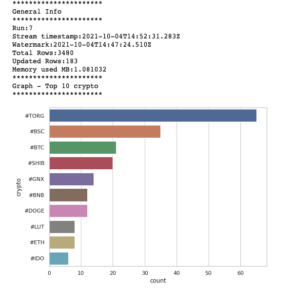

# Tweet Analysis for Crypto Hashtags using Kafka and Spark Streaming
This project is to demonstrate how to
- stream real time Twitter feeds with Apache Kafka,
- analyze the data with Apache Spark,
- and visualize the real-time crypto hashtag count in Jupyter Notebook. 

The setup of those tools is quite complicated so docker is used to spin up all the applicaions

## Installation Guide
1. Clone this project
2. Sign up for Twitter developer account and get the following OAuth authentication details:
    - `ACCESS_TOKEN`

    - `ACCESS_TOKEN_SECRET`

    - `CONSUMER_KEY`

    - `CONSUMER_SECRET`

    Then create a `.env` file in `notebooks` and store above credentials in the file
3. Start the containers
```
docker-compose up -d
```
4. Get the link of jupyter notebook inside spark container
```
docker exec -it tweet-crypto-kafka-spark-streaming_spark_1 bash
jupyter notebook list
```
5. Open the jupyter notebook and run `twitter-producer.ipynb` to produce the streaming Tweet data in Kafka

6. Run `twitter-spark-consumer.ipynb` to visualize the hastag count (sliding window of 5 minutes and refresh every 10 seconds)


7. Stop the containers
```
docker-compose down
```

## References
- https://docs.tweepy.org/en/v3.10.0/
- https://github.com/cordon-thiago/spark-kafka-consumer
- https://github.com/vprusso/youtube_tutorials/tree/master/twitter_python


